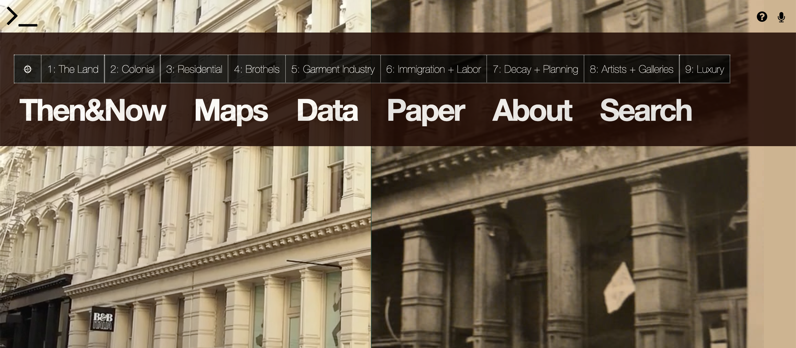
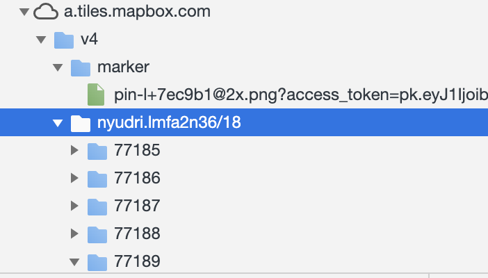
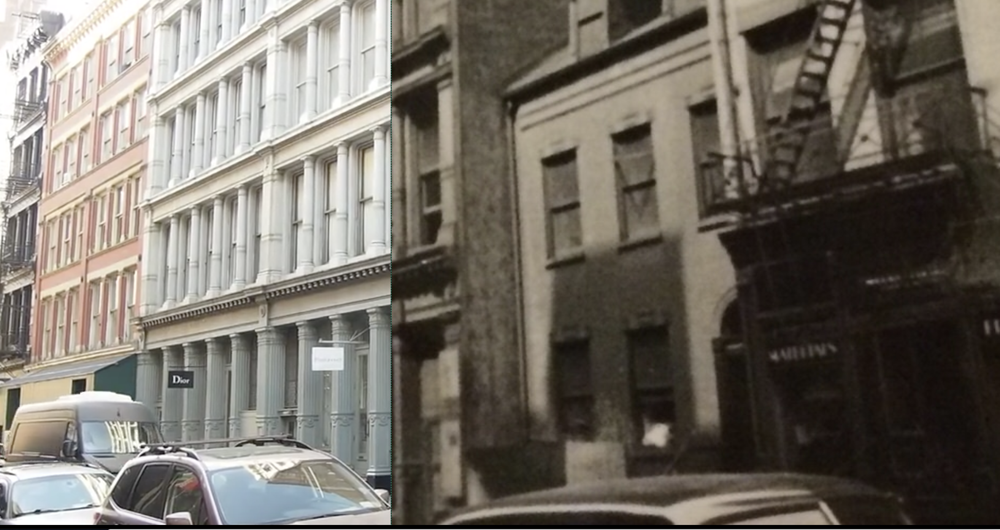
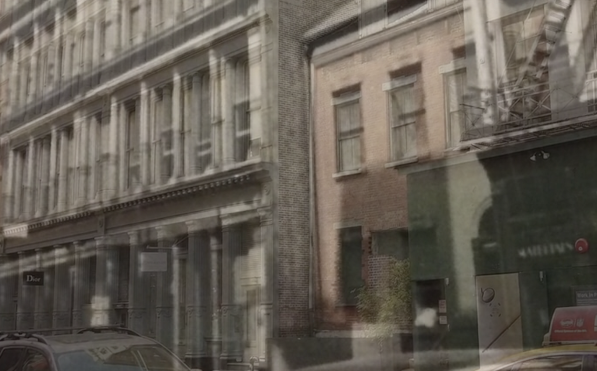

<h1><b>
Greene Street in NYC
</b></h1>

<b>Project Link:</b>
<a href="http://www.greenestreet.nyc/home">GreeneStreet.nyc</a>

<b>Location</b>: 486 feet of present-day Greene Street between Houston and Prince Streets in Manhattan, New York.
  

<h2><b>Introduction</b></h2>
On Greene Street, between Prince and Houston in the heart of Manhattan ’s SoHo neighborhood. On both sides of the street, luxury shops of various trends gather. This street has become a must-visit place when visiting New York. This project is to study how Greene Street gradually changes from land to one of the most prosperous streets in New York. This project uses rich pictures, videos, and sounds to make people feel immersive in Greene Street at different times. There are also a lot of data and materials for people to deeply study the impact of the era background on this street. For location researches, this project is a good example of using GIS to provide a valuable experience for urban planning and design.

### <h2><b>Major Functions</b></h2>
* At five locations on Greene Street, compare pictures from the mid-20th century and the 21st century.
* The pictures, graphs, newspaper, and music show the appearance of Greene Street in the nine periods. Map Story way to explain the background of each era.
* Working Paper offers a main report to analyze Greene Street development.
* Search bar for querying citations.

<h2><b>Audience</b></h2>
The project is designed for all people, because of the convenient operation and interesting content. Anyone who is interested in local development or history can use this website to study. More valuable is that this project also provides a lot of data and information for students who study urban planning, history and geography.

<h2><b>Authors</h2></b>

| Position | Name | Institution |
| ------------- | ------------- | -------------|
| Researcher/Developer/Writer | William Easterly, Laura Freschi, and Steven Pennings  | the NYU Development Research Institute (DRI) |
| Research Assistance  | Marina Kosyachenko, Lauren Hanson, and Fred Rossoff  |
| Further Researcher/Web content/Design/Sound/Video/Web Production  | Madeline Blount | Individual|

### <h2><b>Systematic Architecture</b></h2>
According to our lecture,
> System architecture for web mapping.
* A line extends from the cloud on the top into a wide rectangle diagram with the label: Internal network.
* The line leads to the drawing of a Web server and then, below the Web server, to a Geospatial server.
* The line then branches to drawings of a file server (left) and a database server (right).
* To the left (within the Internal network rectangler) is another computer drawing with the label: Administrators and internal client applications. Desktop workstations that are used by administrators and internal client applications. These machines will also be used to prepare data, author maps, and sometimes administer the other machines.

It’s Client-server model. Clients and servers shared the tasks and services that the system was supposed to perform. Retrieving a website using a URL address that directs to a server to load the site in the client’s browser is an example of the two-layer model, also known as the client-server model.
>A server computer can manage several clients simultaneously, whereas one client can be connected to several servers at a time, each providing a different set of services. In its simplest form, the internet is also based on client/server architecture where web servers serve many simultaneous users with website data.

<h2><b>Coding</b></h2>
Between the client and server, there are mainly data about comparing different period of the Greene street. In the main page, in the assets file, there are two period pictures of the Greene street. In the rest of the pages there are also data of maps, statistic, paper, and different period pictures and stores. The major libraries in use is under every1.js. Their functions include playing videos, adjust the volume, setting up the timeline, switching different pages, and making it full screen.

`if ($("video").length > 0) {
 $("video")[0].volume = 0;
  $("video").bind('contextmenu',function() {
  return false;
   });
 }  	`

`$("#volume").click(function() {
  $("audio#bg").prop('muted', true);
  $(this).addClass("hide");
  $(this).removeClass("live");
  $("#volume2").removeClass("hide");
  $("#volume2").addClass("live");
});`

`$("div#fullscreen").click(function() {
    $(this).fadeOut("fast");
    $("div#fullscreen2").fadeIn("fast");
});`

`$("ul.timeline li").click(function() {
  $("audio#bg").animate({volume: 0}, 1000);
  $(document.body).fadeOut(1000);
});`

`$("li.home").click(function() {
  setTimeout("location.href = '/home';",delay);
 });
 $("li.one").click(function() {
  setTimeout("location.href = '/1-the-land';",delay);
 });
 $("li.two").click(function() {
  setTimeout("location.href = '/2-colonial';",delay);
 });
 $("li.three").click(function() {
  setTimeout("location.href = '/3-residential';",delay);
 });
 $("li.four").click(function() {
  setTimeout("location.href = '/4-brothels';",delay);
 });
 $("li.five").click(function() {
  setTimeout("location.href = '/5-garments';",delay);
 });
 $("li.six").click(function() {
  setTimeout("location.href = '/6-labor';",delay);
 });
 $("li.seven").click(function() {
  setTimeout("location.href = '/7-urban';",delay);
 });
 $("li.eight").click(function() {
  setTimeout("location.href = '/8-artists';",delay);
 });
 $("li.nine").click(function() {
  setTimeout("location.href = '/9-luxury';",delay);
 });`

Yes. The project support responsive design, and the address it’s from “home” to “home-m”. However, when client using mobile it will only show about their report of Greene Street. It doesn't have strong functions as PC.

<h2><b>Data Sources</b></h2>
 On the "Then and Now" page, there are vectors(geojson) and rasters(tilelayers) data from Mapbox.com.

 

 For the Web Mapping design, it only has one layer to show people the different locations on the Greene Street. Therefore, it’s pretty straight forward to the topic and easy to understand. The map page is clear and simple, and I think it’s better to use color to highlight on the Greene Street instead of only black and white. In the way, it could help people to find the targeted location directly. Also, I really like the design that when I tried to click the detail images, there were a bottom for me to go back to the interact map (main page) which is convenient. To compare the two period of Greene Street, you could go with two options. One is put two pictures half-half on the same screen,

 

 and the other option is opacity which two pictures overlap perfectly and with a proper transparency.

  

For perfect the project, I think the project could improve on the Web Mapping design on deleting a clickable link for the image page. Because on the same popup frame there are two links for one same page. When we do the Web Designing, we would like to make the page clean and simple, and it will be helpful to delete duplicate functions and content on the same page. Simple operation will allow users to understand the operation of this project faster, avoiding doubts caused by too many links.

<h2><b>Basemap</b></h2>
The basemap is designed on Mapbox with simply white and black color. Black lines mean the main roads, and the thinner lines represent small streets and buildings. The thematic layer is the points to show the different locations on the Greene Street. All the markers are clickable to access the image page that people can compare two period at the same page. Clear lines help people ignore the basemap as much as possible, which is also the goal of good basemaps. And the light green markers also highlight the key points very well, making it easier for users to understand the map fuctions.

<h2><b>Map element</b></h2>
 There are no scalar bar, north arrow and legend. There is attribute to acknowledge the Mapbox and OpenStreetMap. Instead of legend there is an information-bottom to help people understand the interact functions. In the map story section, there is a north arrow but not for point the north, it navigates the next pages of the story.

<h2><b>Strengths</b></h2>
I like the project that is why I choose it as my examined project. It uses an attractive way that compare two period pictures on the same location to let people understand what the web designed for, and also there are many information for different period. Although there is only about the Greene Street, you will access many aspects information about it and understand the whole city background. Also, it uses different background music to represent different periods, for example, the colonial era used the sound of a horseshoe. In the era of immigration, the sound effects of the radio were used to express the busy labor life. In the era of luxury, it became light pop music. For the different periods, it uses the map stores way to show people the details. The project uses the sounds, pictures, and interacted functions to let people understand the history of Greene Street, which it’s creative. Because of the interaction of eyes and ears, the user experience is enriched. It is no longer just boring text and maps to explain the facts, more often you will want to learn more because of this interesting interaction.

<h2><b>Weakness</b></h2>
As I said the project has a lot of functions, on the other hands, people need to spend some time to figure them out. There are mainly two lines for the Greene Street. One is nine different periods of picture and brief stories, and the other line is the interactive map, data, and other information. The design is a little complicate and may confuse people what’s the main part. It will be better if the users could understand which are primary and secondary. On this website, in many cases, many buttons lead to the same page. I understand that because this project wants different ways of organizing information. But this may degrade the user's experience. I think it's better to put a headline on each way of sorting out information, so that users can choose their own way to study Greene Street.

<h2><b>Summary</b></h2>
This project has a good idea about checking the history of a location, especially people could compare different period. Not only a specific location, it also represents a history of a region even a country. The project defiantly is a good example for urban designing. People will understand why and how the location develop gradually till now. This is a very impressive thing, when you see what the luxury and high-end streets have experienced. From an undeveloped land, it gradually began to be colonized, developed, and landmark. You will see the reasons for each step of development and the details of city planning. Although this project only focused on a small street, what we saw was that different people brought different cultures and produced different influences to leave different atmospheres.
